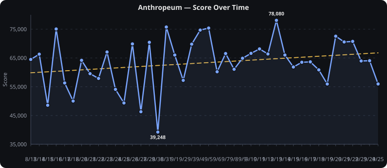
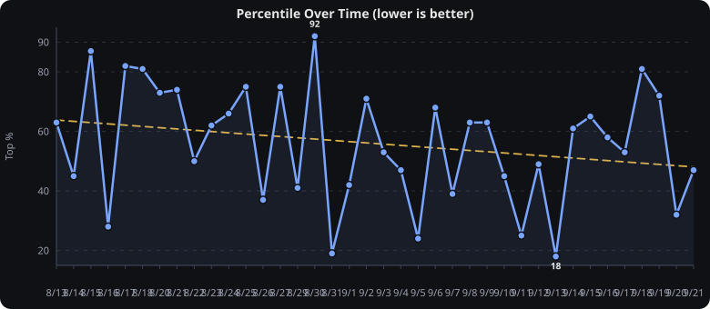
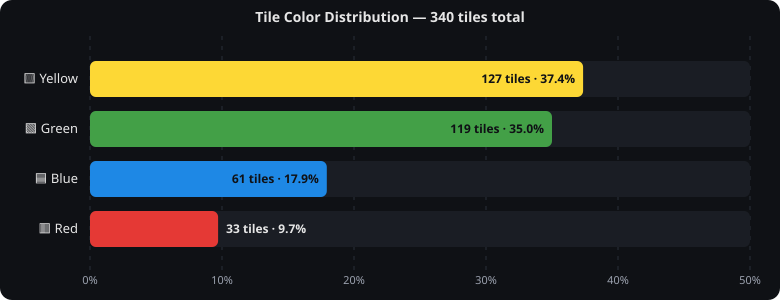
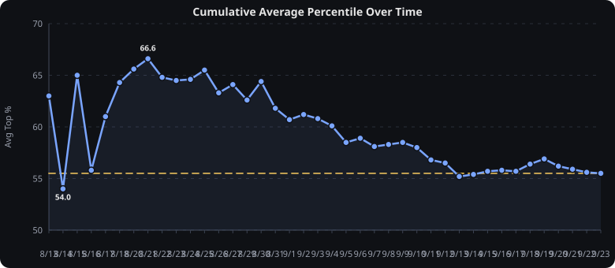

# Anthropeum — Score History

Daily scores scraped from the files in this repo. Each file is named `M_D` (e.g. `8_13` → Aug 13) and line 3 holds the score (`64,497 · top 63% ...`). This README is auto-generated by `generate_readme.py` — re-run it after adding a new day.

## Data Table

<details>
<summary>Data Table — 26 rows (click to expand)</summary>

| Date | File | Tiles | Score | Percentile | Δ vs Avg | 🟨 Yellow | 🟩 Green | 🟦 Blue | 🟥 Red |
|------|------|-------|-------|------------|----------|-----------|----------|---------|--------|
| Aug 13 2026 | `8_13` | 🟨🟨🟩🟩🟨🟩🟨🟦🟨🟩 | **64,497** | top 63% | +2,558 | 5 | 4 | 1 | 0 |
| Aug 14 2026 | `8_14` | 🟨🟨🟦🟦🟩🟨🟩🟦🟩🟨 | **66,309** | top 45% | +4,370 | 4 | 3 | 3 | 0 |
| Aug 15 2026 | `8_15` | 🟩🟩🟨🟨🟩🟨🟥🟥🟨🟩 | **48,569** | top 87% | -13,370 | 4 | 4 | 0 | 2 |
| Aug 16 2026 | `8_16` | 🟩🟨🟨🟩🟩🟩🟩🟨🟩🟦 | **75,078** | top 28% | +13,139 | 3 | 6 | 1 | 0 |
| Aug 17 2026 | `8_17` | 🟨🟥🟨🟨🟦🟨🟩🟨🟨🟦 | **56,316** | top 82% | -5,623 | 6 | 1 | 2 | 1 |
| Aug 18 2026 | `8_18` | 🟨🟨🟨🟨🟩🟦🟨🟥🟨🟨 | **50,037** | top 81% | -11,902 | 7 | 1 | 1 | 1 |
| Aug 20 2026 | `8_20` | 🟩🟨🟩🟩🟩🟥🟨🟦🟩🟩 | **64,181** | top 73% | +2,242 | 2 | 6 | 1 | 1 |
| Aug 21 2026 | `8_21` | 🟨🟩🟩🟨🟨🟦🟨🟩🟨🟨 | **59,541** | top 74% | -2,398 | 6 | 3 | 1 | 0 |
| Aug 22 2026 | `8_22` | 🟥🟥🟨🟩🟨🟨🟦🟩🟩🟩 | **57,891** | top 50% | -4,048 | 3 | 4 | 1 | 2 |
| Aug 23 2026 | `8_23` | 🟦🟩🟨🟨🟨🟨🟩🟩🟦🟨 | **67,070** | top 62% | +5,131 | 5 | 3 | 2 | 0 |
| Aug 24 2026 | `8_24` | 🟩🟨🟨🟩🟩🟩🟨🟨🟨🟨 | **54,082** | top 66% | -7,857 | 6 | 4 | 0 | 0 |
| Aug 25 2026 | `8_25` | 🟨🟩🟩🟩🟥🟨🟨🟨🟥🟨 | **49,359** | top 75% | -12,580 | 5 | 3 | 0 | 2 |
| Aug 26 2026 | `8_26` | 🟩🟩🟨🟦🟦🟩🟩🟨🟨🟨 | **69,883** | top 37% | +7,944 | 4 | 4 | 2 | 0 |
| Aug 27 2026 | `8_27` | 🟨🟩🟥🟨🟥🟩🟨🟨🟩🟥 | **46,314** | top 75% | -15,625 | 4 | 3 | 0 | 3 |
| Aug 29 2026 | `8_29` | 🟩🟥🟦🟩🟨🟩🟨🟩🟦🟩 | **70,427** | top 41% | +8,488 | 2 | 5 | 2 | 1 |
| Aug 30 2026 | `8_30` | 🟥🟩🟥🟥🟨🟨🟦🟥🟨🟥 | **39,248** | top 92% | -22,691 | 3 | 1 | 1 | 5 |
| Aug 31 2026 | `8_31` | 🟦🟦🟦🟩🟩🟨🟦🟩🟨🟨 | **75,763** | top 19% | +13,824 | 3 | 3 | 4 | 0 |
| Sep 1 2026 | `9_1` | 🟩🟨🟨🟩🟦🟨🟨🟨🟩🟦 | **66,013** | top 42% | +4,074 | 5 | 3 | 2 | 0 |
| Sep 2 2026 | `9_2` | 🟩🟨🟥🟥🟦🟩🟨🟩🟩🟨 | **57,221** | top 71% | -4,718 | 3 | 4 | 1 | 2 |
| Sep 3 2026 | `9_3` | 🟨🟨🟦🟥🟩🟦🟩🟩🟩🟩 | **69,801** | top 53% | +7,862 | 2 | 5 | 2 | 1 |
| Sep 4 2026 | `9_4` | 🟦🟦🟨🟩🟨🟨🟦🟩🟨🟩 | **74,700** | top 47% | +12,761 | 4 | 3 | 3 | 0 |
| Sep 5 2026 | `9_5` | 🟦🟦🟩🟩🟩🟦🟩🟥🟨🟩 | **75,404** | top 24% | +13,465 | 1 | 5 | 3 | 1 |
| Sep 6 2026 | `9_6` | 🟨🟦🟩🟩🟨🟨🟩🟩🟨🟥 | **60,210** | top 68% | -1,729 | 4 | 4 | 1 | 1 |
| Sep 7 2026 | `9_7` | 🟩🟩🟩🟨🟩🟨🟦🟦🟩🟥 | **66,528** | top 39% | +4,589 | 2 | 5 | 2 | 1 |
| Sep 8 2026 | `9_8` | 🟦🟨🟨🟨🟨🟥🟩🟨🟦🟦 | **61,073** | top 63% | -866 | 5 | 1 | 3 | 1 |
| Sep 9 2026 | `9_9` | 🟩🟥🟩🟨🟩🟦🟨🟨🟩🟦 | **64,901** | top 63% | +2,962 | 3 | 4 | 2 | 1 |

</details>

## Scores Over Time




## Percentile Over Time





## Tile Color Distribution




## Cumulative Average Percentile




## At a Glance

- **Average score:** **61,939.08**
- **Average percentile:** **top 58.5%**
- **Best score:** **75,763** (`8_31`) — top 19% 
- **Worst score:** **39,248** (`8_30`) — top 92%
- **Best percentile:** top 19% (`8_31`) — 75,763
- **Worst percentile:** top 92% (`8_30`) — 39,248
- **Median score:** 64,497
- **Range:** 36,515 ( 39,248 → 75,763)


## Raw Stats Dump

```
Count: 26
Scores: 64,497, 66,309, 48,569, 75,078, 56,316, 50,037, 64,181, 59,541, 57,891, 67,070, 54,082, 49,359, 69,883, 46,314, 70,427, 39,248, 75,763, 66,013, 57,221, 69,801, 74,700, 75,404, 60,210, 66,528, 61,073, 64,901
Min: 39,248 (8_30)  Max: 75,763 (8_31)
Overall avg score: 61939.08
Overall avg percentile: top 58.46%
Cumulative avgs: 64,497, 65,403, 59,792, 63,613, 62,154, 60,134, 60,712, 60,566, 60,269, 60,949, 60,325, 59,411, 60,216, 59,223, 59,970, 58,675, 59,680, 60,032, 59,884, 60,380, 61,062, 61,714, 61,648, 61,852, 61,821, 61,939
Cumulative avg percentiles: 63.0%, 54.0%, 65.0%, 55.8%, 61.0%, 64.3%, 65.6%, 66.6%, 64.8%, 64.5%, 64.6%, 65.5%, 63.3%, 64.1%, 62.6%, 64.4%, 61.8%, 60.7%, 61.2%, 60.8%, 60.1%, 58.5%, 58.9%, 58.1%, 58.3%, 58.5%
Tiles: 🟨 Yellow 101 (38.8%), 🟩 Green 92 (35.4%), 🟦 Blue 41 (15.8%), 🟥 Red 26 (10.0%) — 260 total
```

---
*Generated from 26 files on disk. See `generate_readme.py` for logic.*
