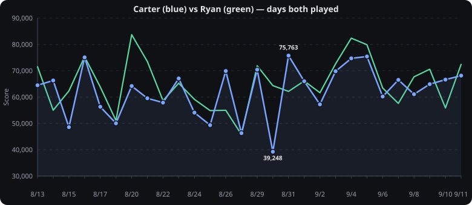

# Anthropeum — Score History

Daily scores scraped from the files in this repo. Each file is named `M_D` (e.g. `8_13` → Aug 13) and line 3 holds the score (`64,497 · top 63% ...`). Other players keep the same layout in a subfolder (e.g. `ryan/`). This README is auto-generated by `generate_readme.py` — re-run it after adding a new day.

## Data Table

<details>
<summary>Data Table — 28 rows (click to expand)</summary>

| Date | File | Tiles | Score | Percentile | Δ vs Avg | 🟨 Yellow | 🟩 Green | 🟦 Blue | 🟥 Red |
|------|------|-------|-------|------------|----------|-----------|----------|---------|--------|
| Aug 13 2026 | `8_13` | 🟨🟨🟩🟩🟨🟩🟨🟦🟨🟩 | **64,497** | top 63% | +2,169 | 5 | 4 | 1 | 0 |
| Aug 14 2026 | `8_14` | 🟨🟨🟦🟦🟩🟨🟩🟦🟩🟨 | **66,309** | top 45% | +3,981 | 4 | 3 | 3 | 0 |
| Aug 15 2026 | `8_15` | 🟩🟩🟨🟨🟩🟨🟥🟥🟨🟩 | **48,569** | top 87% | -13,759 | 4 | 4 | 0 | 2 |
| Aug 16 2026 | `8_16` | 🟩🟨🟨🟩🟩🟩🟩🟨🟩🟦 | **75,078** | top 28% | +12,750 | 3 | 6 | 1 | 0 |
| Aug 17 2026 | `8_17` | 🟨🟥🟨🟨🟦🟨🟩🟨🟨🟦 | **56,316** | top 82% | -6,012 | 6 | 1 | 2 | 1 |
| Aug 18 2026 | `8_18` | 🟨🟨🟨🟨🟩🟦🟨🟥🟨🟨 | **50,037** | top 81% | -12,291 | 7 | 1 | 1 | 1 |
| Aug 20 2026 | `8_20` | 🟩🟨🟩🟩🟩🟥🟨🟦🟩🟩 | **64,181** | top 73% | +1,853 | 2 | 6 | 1 | 1 |
| Aug 21 2026 | `8_21` | 🟨🟩🟩🟨🟨🟦🟨🟩🟨🟨 | **59,541** | top 74% | -2,787 | 6 | 3 | 1 | 0 |
| Aug 22 2026 | `8_22` | 🟥🟥🟨🟩🟨🟨🟦🟩🟩🟩 | **57,891** | top 50% | -4,437 | 3 | 4 | 1 | 2 |
| Aug 23 2026 | `8_23` | 🟦🟩🟨🟨🟨🟨🟩🟩🟦🟨 | **67,070** | top 62% | +4,742 | 5 | 3 | 2 | 0 |
| Aug 24 2026 | `8_24` | 🟩🟨🟨🟩🟩🟩🟨🟨🟨🟨 | **54,082** | top 66% | -8,246 | 6 | 4 | 0 | 0 |
| Aug 25 2026 | `8_25` | 🟨🟩🟩🟩🟥🟨🟨🟨🟥🟨 | **49,359** | top 75% | -12,969 | 5 | 3 | 0 | 2 |
| Aug 26 2026 | `8_26` | 🟩🟩🟨🟦🟦🟩🟩🟨🟨🟨 | **69,883** | top 37% | +7,555 | 4 | 4 | 2 | 0 |
| Aug 27 2026 | `8_27` | 🟨🟩🟥🟨🟥🟩🟨🟨🟩🟥 | **46,314** | top 75% | -16,014 | 4 | 3 | 0 | 3 |
| Aug 29 2026 | `8_29` | 🟩🟥🟦🟩🟨🟩🟨🟩🟦🟩 | **70,427** | top 41% | +8,099 | 2 | 5 | 2 | 1 |
| Aug 30 2026 | `8_30` | 🟥🟩🟥🟥🟨🟨🟦🟥🟨🟥 | **39,248** | top 92% | -23,080 | 3 | 1 | 1 | 5 |
| Aug 31 2026 | `8_31` | 🟦🟦🟦🟩🟩🟨🟦🟩🟨🟨 | **75,763** | top 19% | +13,435 | 3 | 3 | 4 | 0 |
| Sep 1 2026 | `9_1` | 🟩🟨🟨🟩🟦🟨🟨🟨🟩🟦 | **66,013** | top 42% | +3,685 | 5 | 3 | 2 | 0 |
| Sep 2 2026 | `9_2` | 🟩🟨🟥🟥🟦🟩🟨🟩🟩🟨 | **57,221** | top 71% | -5,107 | 3 | 4 | 1 | 2 |
| Sep 3 2026 | `9_3` | 🟨🟨🟦🟥🟩🟦🟩🟩🟩🟩 | **69,801** | top 53% | +7,473 | 2 | 5 | 2 | 1 |
| Sep 4 2026 | `9_4` | 🟦🟦🟨🟩🟨🟨🟦🟩🟨🟩 | **74,700** | top 47% | +12,372 | 4 | 3 | 3 | 0 |
| Sep 5 2026 | `9_5` | 🟦🟦🟩🟩🟩🟦🟩🟥🟨🟩 | **75,404** | top 24% | +13,076 | 1 | 5 | 3 | 1 |
| Sep 6 2026 | `9_6` | 🟨🟦🟩🟩🟨🟨🟩🟩🟨🟥 | **60,210** | top 68% | -2,118 | 4 | 4 | 1 | 1 |
| Sep 7 2026 | `9_7` | 🟩🟩🟩🟨🟩🟨🟦🟦🟩🟥 | **66,528** | top 39% | +4,200 | 2 | 5 | 2 | 1 |
| Sep 8 2026 | `9_8` | 🟦🟨🟨🟨🟨🟥🟩🟨🟦🟦 | **61,073** | top 63% | -1,255 | 5 | 1 | 3 | 1 |
| Sep 9 2026 | `9_9` | 🟩🟥🟩🟨🟩🟦🟨🟨🟩🟦 | **64,901** | top 63% | +2,573 | 3 | 4 | 2 | 1 |
| Sep 10 2026 | `9_10` | 🟩🟥🟨🟩🟩🟩🟨🟦🟦🟨 | **66,608** | top 45% | +4,280 | 3 | 4 | 2 | 1 |
| Sep 11 2026 | `9_11` | 🟩🟥🟨🟩🟩🟦🟦🟨🟦🟨 | **68,150** | top 25% | +5,822 | 3 | 3 | 3 | 1 |

</details>

## Scores Over Time


## Percentile Over Time


## Tile Color Distribution


## Cumulative Average Percentile


## Head to Head — Carter vs Ryan

Ryan's files live in `ryan/` with the same `M_D` layout. Ryan: **32** games, avg **64,561**, avg percentile **top 48.8%**, best **83,699** (`8_20`).



- **Record (Carter–Ryan):** **7–21** over 28 shared days
- **Average on shared days:** Carter 62,328 · Ryan 65,128 (-2,800)
- **Average percentile on shared days:** Carter top 56.8% · Ryan top 47.4%
- **Biggest Carter win:** +14,894 on Aug 26 2026 · **Biggest Ryan win:** +25,101 on Aug 30 2026


<details>
<summary>Day by day — 28 shared days (click to expand)</summary>

| Date | Carter | Ryan | Δ | Winner |
|------|------|------|---|--------|
| Aug 13 2026 | **64,497** (top 63%) | **71,516** (top 38%) | -7,019 | Ryan |
| Aug 14 2026 | **66,309** (top 45%) | **55,004** (top 82%) | +11,305 | Carter |
| Aug 15 2026 | **48,569** (top 87%) | **62,336** (top 40%) | -13,767 | Ryan |
| Aug 16 2026 | **75,078** (top 28%) | **75,307** (top 27%) | -229 | Ryan |
| Aug 17 2026 | **56,316** (top 82%) | **63,836** (top 68%) | -7,520 | Ryan |
| Aug 18 2026 | **50,037** (top 81%) | **51,099** (top 81%) | -1,062 | Ryan |
| Aug 20 2026 | **64,181** (top 73%) | **83,699** (top 6%) | -19,518 | Ryan |
| Aug 21 2026 | **59,541** (top 74%) | **73,512** (top 27%) | -13,971 | Ryan |
| Aug 22 2026 | **57,891** (top 50%) | **58,642** (top 42%) | -751 | Ryan |
| Aug 23 2026 | **67,070** (top 62%) | **65,260** (top 68%) | +1,810 | Carter |
| Aug 24 2026 | **54,082** (top 66%) | **59,134** (top 51%) | -5,052 | Ryan |
| Aug 25 2026 | **49,359** (top 75%) | **54,860** (top 53%) | -5,501 | Ryan |
| Aug 26 2026 | **69,883** (top 37%) | **54,989** (top 82%) | +14,894 | Carter |
| Aug 27 2026 | **46,314** (top 75%) | **45,784** (top 80%) | +530 | Carter |
| Aug 29 2026 | **70,427** (top 41%) | **71,875** (top 41%) | -1,448 | Ryan |
| Aug 30 2026 | **39,248** (top 92%) | **64,349** (top 17%) | -25,101 | Ryan |
| Aug 31 2026 | **75,763** (top 19%) | **62,142** (top 59%) | +13,621 | Carter |
| Sep 1 2026 | **66,013** (top 42%) | **66,117** (top 42%) | -104 | Ryan |
| Sep 2 2026 | **57,221** (top 71%) | **61,640** (top 58%) | -4,419 | Ryan |
| Sep 3 2026 | **69,801** (top 53%) | **72,639** (top 37%) | -2,838 | Ryan |
| Sep 4 2026 | **74,700** (top 47%) | **82,374** (top 17%) | -7,674 | Ryan |
| Sep 5 2026 | **75,404** (top 24%) | **79,887** (top 10%) | -4,483 | Ryan |
| Sep 6 2026 | **60,210** (top 68%) | **63,431** (top 62%) | -3,221 | Ryan |
| Sep 7 2026 | **66,528** (top 39%) | **57,593** (top 70%) | +8,935 | Carter |
| Sep 8 2026 | **61,073** (top 63%) | **67,689** (top 34%) | -6,616 | Ryan |
| Sep 9 2026 | **64,901** (top 63%) | **70,591** (top 40%) | -5,690 | Ryan |
| Sep 10 2026 | **66,608** (top 45%) | **55,868** (top 83%) | +10,740 | Carter |
| Sep 11 2026 | **68,150** (top 25%) | **72,402** (top 13%) | -4,252 | Ryan |

</details>

## At a Glance

- **Average score:** **62,327.64**
- **Average percentile:** **top 56.8%**
- **Best score:** **75,763** (`8_31`) — top 19% 
- **Worst score:** **39,248** (`8_30`) — top 92%
- **Best percentile:** top 19% (`8_31`) — 75,763
- **Worst percentile:** top 92% (`8_30`) — 39,248
- **Median score:** 64,901
- **Range:** 36,515 ( 39,248 → 75,763)


## Raw Stats Dump

```
Count: 28
Scores: 64,497, 66,309, 48,569, 75,078, 56,316, 50,037, 64,181, 59,541, 57,891, 67,070, 54,082, 49,359, 69,883, 46,314, 70,427, 39,248, 75,763, 66,013, 57,221, 69,801, 74,700, 75,404, 60,210, 66,528, 61,073, 64,901, 66,608, 68,150
Min: 39,248 (8_30)  Max: 75,763 (8_31)
Overall avg score: 62327.64
Overall avg percentile: top 56.79%
Cumulative avgs: 64,497, 65,403, 59,792, 63,613, 62,154, 60,134, 60,712, 60,566, 60,269, 60,949, 60,325, 59,411, 60,216, 59,223, 59,970, 58,675, 59,680, 60,032, 59,884, 60,380, 61,062, 61,714, 61,648, 61,852, 61,821, 61,939, 62,112, 62,328
Cumulative avg percentiles: 63.0%, 54.0%, 65.0%, 55.8%, 61.0%, 64.3%, 65.6%, 66.6%, 64.8%, 64.5%, 64.6%, 65.5%, 63.3%, 64.1%, 62.6%, 64.4%, 61.8%, 60.7%, 61.2%, 60.8%, 60.1%, 58.5%, 58.9%, 58.1%, 58.3%, 58.5%, 58.0%, 56.8%
Tiles: 🟨 Yellow 107 (38.2%), 🟩 Green 99 (35.4%), 🟦 Blue 46 (16.4%), 🟥 Red 28 (10.0%) — 280 total
```

---
*Generated from 28 files on disk. See `generate_readme.py` for logic.*
