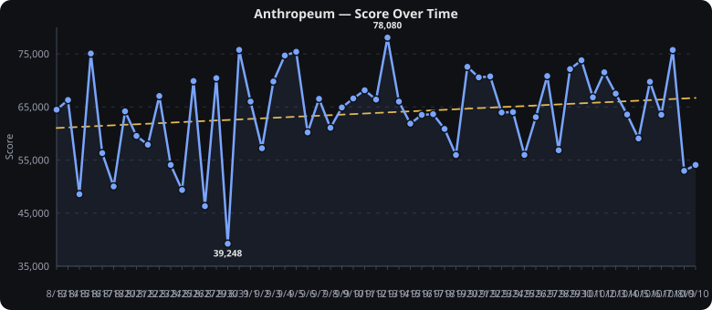
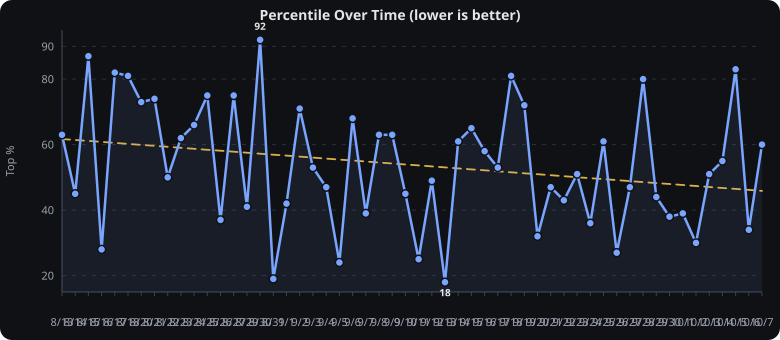
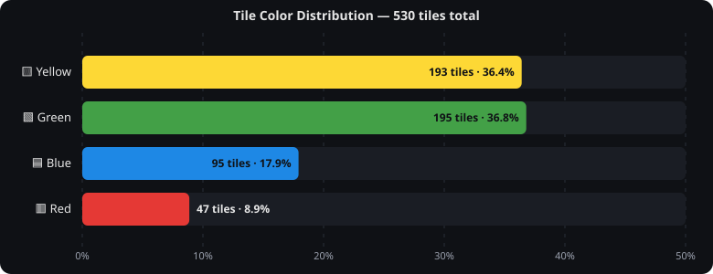
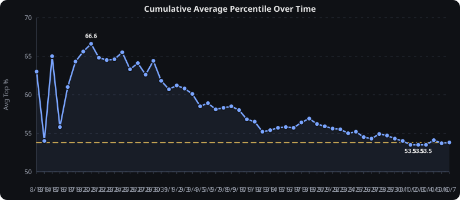

# Anthropeum — Score History

Daily scores scraped from the files in this repo. Each file is named `M_D` (e.g. `8_13` → Aug 13) and line 3 holds the score (`64,497 · top 63% ...`). This README is auto-generated by `generate_readme.py` — re-run it after adding a new day.

## Data Table

<details>
<summary>Data Table — 49 rows (click to expand)</summary>

| Date | File | Tiles | Score | Percentile | Δ vs Avg | 🟨 Yellow | 🟩 Green | 🟦 Blue | 🟥 Red |
|------|------|-------|-------|------------|----------|-----------|----------|---------|--------|
| Aug 13 2026 | `8_13` | 🟨🟨🟩🟩🟨🟩🟨🟦🟨🟩 | **64,497** | top 63% | +530 | 5 | 4 | 1 | 0 |
| Aug 14 2026 | `8_14` | 🟨🟨🟦🟦🟩🟨🟩🟦🟩🟨 | **66,309** | top 45% | +2,342 | 4 | 3 | 3 | 0 |
| Aug 15 2026 | `8_15` | 🟩🟩🟨🟨🟩🟨🟥🟥🟨🟩 | **48,569** | top 87% | -15,398 | 4 | 4 | 0 | 2 |
| Aug 16 2026 | `8_16` | 🟩🟨🟨🟩🟩🟩🟩🟨🟩🟦 | **75,078** | top 28% | +11,111 | 3 | 6 | 1 | 0 |
| Aug 17 2026 | `8_17` | 🟨🟥🟨🟨🟦🟨🟩🟨🟨🟦 | **56,316** | top 82% | -7,651 | 6 | 1 | 2 | 1 |
| Aug 18 2026 | `8_18` | 🟨🟨🟨🟨🟩🟦🟨🟥🟨🟨 | **50,037** | top 81% | -13,930 | 7 | 1 | 1 | 1 |
| Aug 20 2026 | `8_20` | 🟩🟨🟩🟩🟩🟥🟨🟦🟩🟩 | **64,181** | top 73% | +214 | 2 | 6 | 1 | 1 |
| Aug 21 2026 | `8_21` | 🟨🟩🟩🟨🟨🟦🟨🟩🟨🟨 | **59,541** | top 74% | -4,426 | 6 | 3 | 1 | 0 |
| Aug 22 2026 | `8_22` | 🟥🟥🟨🟩🟨🟨🟦🟩🟩🟩 | **57,891** | top 50% | -6,076 | 3 | 4 | 1 | 2 |
| Aug 23 2026 | `8_23` | 🟦🟩🟨🟨🟨🟨🟩🟩🟦🟨 | **67,070** | top 62% | +3,103 | 5 | 3 | 2 | 0 |
| Aug 24 2026 | `8_24` | 🟩🟨🟨🟩🟩🟩🟨🟨🟨🟨 | **54,082** | top 66% | -9,885 | 6 | 4 | 0 | 0 |
| Aug 25 2026 | `8_25` | 🟨🟩🟩🟩🟥🟨🟨🟨🟥🟨 | **49,359** | top 75% | -14,608 | 5 | 3 | 0 | 2 |
| Aug 26 2026 | `8_26` | 🟩🟩🟨🟦🟦🟩🟩🟨🟨🟨 | **69,883** | top 37% | +5,916 | 4 | 4 | 2 | 0 |
| Aug 27 2026 | `8_27` | 🟨🟩🟥🟨🟥🟩🟨🟨🟩🟥 | **46,314** | top 75% | -17,653 | 4 | 3 | 0 | 3 |
| Aug 29 2026 | `8_29` | 🟩🟥🟦🟩🟨🟩🟨🟩🟦🟩 | **70,427** | top 41% | +6,460 | 2 | 5 | 2 | 1 |
| Aug 30 2026 | `8_30` | 🟥🟩🟥🟥🟨🟨🟦🟥🟨🟥 | **39,248** | top 92% | -24,719 | 3 | 1 | 1 | 5 |
| Aug 31 2026 | `8_31` | 🟦🟦🟦🟩🟩🟨🟦🟩🟨🟨 | **75,763** | top 19% | +11,796 | 3 | 3 | 4 | 0 |
| Sep 1 2026 | `9_1` | 🟩🟨🟨🟩🟦🟨🟨🟨🟩🟦 | **66,013** | top 42% | +2,046 | 5 | 3 | 2 | 0 |
| Sep 2 2026 | `9_2` | 🟩🟨🟥🟥🟦🟩🟨🟩🟩🟨 | **57,221** | top 71% | -6,746 | 3 | 4 | 1 | 2 |
| Sep 3 2026 | `9_3` | 🟨🟨🟦🟥🟩🟦🟩🟩🟩🟩 | **69,801** | top 53% | +5,834 | 2 | 5 | 2 | 1 |
| Sep 4 2026 | `9_4` | 🟦🟦🟨🟩🟨🟨🟦🟩🟨🟩 | **74,700** | top 47% | +10,733 | 4 | 3 | 3 | 0 |
| Sep 5 2026 | `9_5` | 🟦🟦🟩🟩🟩🟦🟩🟥🟨🟩 | **75,404** | top 24% | +11,437 | 1 | 5 | 3 | 1 |
| Sep 6 2026 | `9_6` | 🟨🟦🟩🟩🟨🟨🟩🟩🟨🟥 | **60,210** | top 68% | -3,757 | 4 | 4 | 1 | 1 |
| Sep 7 2026 | `9_7` | 🟩🟩🟩🟨🟩🟨🟦🟦🟩🟥 | **66,528** | top 39% | +2,561 | 2 | 5 | 2 | 1 |
| Sep 8 2026 | `9_8` | 🟦🟨🟨🟨🟨🟥🟩🟨🟦🟦 | **61,073** | top 63% | -2,894 | 5 | 1 | 3 | 1 |
| Sep 9 2026 | `9_9` | 🟩🟥🟩🟨🟩🟦🟨🟨🟩🟦 | **64,901** | top 63% | +934 | 3 | 4 | 2 | 1 |
| Sep 10 2026 | `9_10` | 🟩🟥🟨🟩🟩🟩🟨🟦🟦🟨 | **66,608** | top 45% | +2,641 | 3 | 4 | 2 | 1 |
| Sep 11 2026 | `9_11` | 🟩🟥🟨🟩🟩🟦🟦🟨🟦🟨 | **68,150** | top 25% | +4,183 | 3 | 3 | 3 | 1 |
| Sep 12 2026 | `9_12` | 🟩🟩🟨🟨🟩🟨🟦🟩🟩🟥 | **66,405** | top 49% | +2,438 | 3 | 5 | 1 | 1 |
| Sep 13 2026 | `9_13` | 🟦🟦🟥🟩🟦🟦🟩🟩🟩🟦 | **78,080** | top 18% | +14,113 | 0 | 4 | 5 | 1 |
| Sep 14 2026 | `9_14` | 🟩🟦🟨🟨🟩🟨🟨🟦🟥🟦 | **66,024** | top 61% | +2,057 | 4 | 2 | 3 | 1 |
| Sep 15 2026 | `9_15` | 🟩🟩🟩🟨🟨🟨🟦🟨🟨🟨 | **61,856** | top 65% | -2,111 | 6 | 3 | 1 | 0 |
| Sep 16 2026 | `9_16` | 🟩🟦🟨🟦🟩🟦🟨🟥🟨🟩 | **63,514** | top 58% | -453 | 3 | 3 | 3 | 1 |
| Sep 17 2026 | `9_17` | 🟥🟩🟩🟩🟨🟨🟦🟨🟨🟦 | **63,646** | top 53% | -321 | 4 | 3 | 2 | 1 |
| Sep 18 2026 | `9_18` | 🟨🟩🟨🟩🟨🟩🟩🟨🟩🟩 | **60,865** | top 81% | -3,102 | 4 | 6 | 0 | 0 |
| Sep 19 2026 | `9_19` | 🟥🟨🟥🟦🟨🟩🟨🟩🟨🟩 | **55,950** | top 72% | -8,017 | 4 | 3 | 1 | 2 |
| Sep 20 2026 | `9_20` | 🟩🟩🟨🟩🟩🟦🟩🟨🟩🟨 | **72,557** | top 32% | +8,590 | 3 | 6 | 1 | 0 |
| Sep 21 2026 | `9_21` | 🟩🟦🟩🟦🟨🟩🟩🟨🟨🟨 | **70,570** | top 47% | +6,603 | 4 | 4 | 2 | 0 |
| Sep 22 2026 | `9_22` | 🟩🟦🟥🟨🟦🟩🟩🟩🟨🟩 | **70,754** | top 43% | +6,787 | 2 | 5 | 2 | 1 |
| Sep 23 2026 | `9_23` | 🟩🟨🟨🟥🟨🟩🟩🟦🟩🟦 | **63,964** | top 51% | -3 | 3 | 4 | 2 | 1 |
| Sep 24 2026 | `9_24` | 🟩🟥🟩🟩🟨🟩🟦🟩🟨🟥 | **64,040** | top 36% | +73 | 2 | 5 | 1 | 2 |
| Sep 25 2026 | `9_25` | 🟨🟨🟨🟩🟨🟨🟥🟩🟦🟩 | **55,964** | top 61% | -8,003 | 5 | 3 | 1 | 1 |
| Sep 26 2026 | `9_26` | 🟦🟩🟩🟩🟩🟨🟨🟩🟥🟨 | **63,084** | top 27% | -883 | 3 | 5 | 1 | 1 |
| Sep 27 2026 | `9_27` | 🟩🟦🟨🟩🟨🟥🟦🟦🟦🟨 | **70,821** | top 47% | +6,854 | 3 | 2 | 4 | 1 |
| Sep 28 2026 | `9_28` | 🟨🟦🟨🟨🟨🟨🟩🟩🟨🟨 | **56,855** | top 80% | -7,112 | 7 | 2 | 1 | 0 |
| Sep 29 2026 | `9_29` | 🟨🟦🟩🟩🟨🟦🟨🟦🟦🟨 | **72,133** | top 44% | +8,166 | 4 | 2 | 4 | 0 |
| Sep 30 2026 | `9_30` | 🟨🟦🟨🟦🟨🟩🟩🟦🟨🟦 | **73,804** | top 38% | +9,837 | 4 | 2 | 4 | 0 |
| Oct 1 2026 | `10_1` | 🟨🟩🟨🟨🟩🟨🟩🟩🟨🟦 | **66,805** | top 39% | +2,838 | 5 | 4 | 1 | 0 |
| Oct 2 2026 | `10_2` | 🟩🟦🟦🟩🟨🟩🟩🟩🟨🟨 | **71,524** | top 30% | +7,557 | 3 | 5 | 2 | 0 |

</details>

## Scores Over Time




## Percentile Over Time





## Tile Color Distribution




## Cumulative Average Percentile




## At a Glance

- **Average score:** **63,967.12**
- **Average percentile:** **top 53.5%**
- **Best score:** **78,080** (`9_13`) — top 18% 
- **Worst score:** **39,248** (`8_30`) — top 92%
- **Best percentile:** top 18% (`9_13`) — 78,080
- **Worst percentile:** top 92% (`8_30`) — 39,248
- **Median score:** 64,901
- **Range:** 38,832 ( 39,248 → 78,080)


## Raw Stats Dump

```
Count: 49
Scores: 64,497, 66,309, 48,569, 75,078, 56,316, 50,037, 64,181, 59,541, 57,891, 67,070, 54,082, 49,359, 69,883, 46,314, 70,427, 39,248, 75,763, 66,013, 57,221, 69,801, 74,700, 75,404, 60,210, 66,528, 61,073, 64,901, 66,608, 68,150, 66,405, 78,080, 66,024, 61,856, 63,514, 63,646, 60,865, 55,950, 72,557, 70,570, 70,754, 63,964, 64,040, 55,964, 63,084, 70,821, 56,855, 72,133, 73,804, 66,805, 71,524
Min: 39,248 (8_30)  Max: 78,080 (9_13)
Overall avg score: 63967.12
Overall avg percentile: top 53.51%
Cumulative avgs: 64,497, 65,403, 59,792, 63,613, 62,154, 60,134, 60,712, 60,566, 60,269, 60,949, 60,325, 59,411, 60,216, 59,223, 59,970, 58,675, 59,680, 60,032, 59,884, 60,380, 61,062, 61,714, 61,648, 61,852, 61,821, 61,939, 62,112, 62,328, 62,468, 62,989, 63,087, 63,048, 63,062, 63,079, 63,016, 62,820, 63,083, 63,280, 63,472, 63,484, 63,498, 63,318, 63,313, 63,483, 63,336, 63,527, 63,746, 63,810, 63,967
Cumulative avg percentiles: 63.0%, 54.0%, 65.0%, 55.8%, 61.0%, 64.3%, 65.6%, 66.6%, 64.8%, 64.5%, 64.6%, 65.5%, 63.3%, 64.1%, 62.6%, 64.4%, 61.8%, 60.7%, 61.2%, 60.8%, 60.1%, 58.5%, 58.9%, 58.1%, 58.3%, 58.5%, 58.0%, 56.8%, 56.5%, 55.2%, 55.4%, 55.7%, 55.8%, 55.7%, 56.4%, 56.9%, 56.2%, 55.9%, 55.6%, 55.5%, 55.0%, 55.2%, 54.5%, 54.3%, 54.9%, 54.7%, 54.3%, 54.0%, 53.5%
Tiles: 🟨 Yellow 183 (37.3%), 🟩 Green 177 (36.1%), 🟦 Blue 88 (18.0%), 🟥 Red 42 (8.6%) — 490 total
```

---
*Generated from 49 files on disk. See `generate_readme.py` for logic.*
